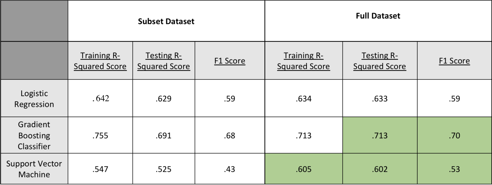
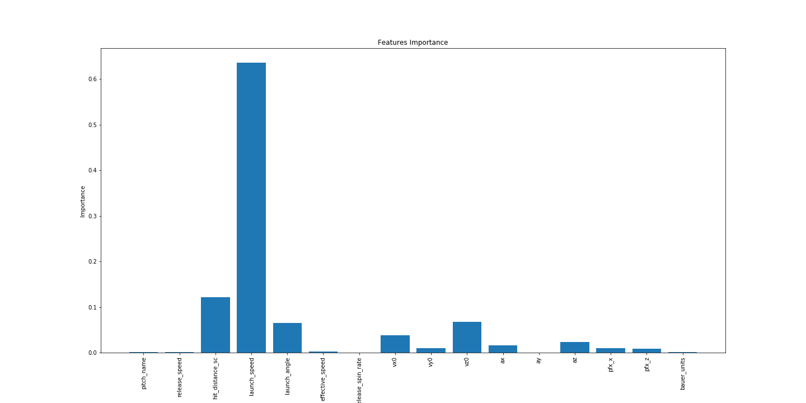

## Pitch_Effective

This project analyzes pitches from Major League Baseball Left Handed Pitchers between the 2015 and 2018 seasons in hopes of evaluating the various pitch metrics and predicting an on field outcome. 

The model evaluations can be found in  Predict_outcome.ipynb. The various data cleaning methods are located within the data_cleaning folder. The scope of this project changed quite a bit, hence the number of cleaning files deriving different forms of the data.

# Data
The data from this project was acquired using the PyBaseball API which pulled statcast data from the 2015-2018 MLB seasons.
The definitions for the column names can be found at this link https://baseballsavant.mlb.com/csv-docs.

Data: https://github.com/jldbc/pybaseball

# Process
After acquiring and cleaning the data, pitching metrics (pitch velocity, movementment measurements, spin rate, exit velocity etc) were feed into the model as depenedent variables and outcomes (strike, ball, foul, Hit-by_pitch, single, double, triple, homerun) were returned as outputs.

The three primary models used were Logistic Regression, Gradient Boosting Classifier, and Support Vector Machine. At first, I tested each model with a subset of the full dataset in order to gauge whether the models would produce sufficient results. This is also in part because when I was initially testing different aspects of the data, some models performed signicantly worse with the full dataset compared to the subset.

The above images displays the R-sqaured scores recorded from the models and their corresponding f1-scores. The logistic regression provided a good base to measure the other models off of. I was encouraged to see that all of the models performed better or remained consistent with their measurement when tested with the full dataset compared to the subset.

In further evaluating the models, the gradient boosting classifier performed the best in terms of accuractely predicting the outcome and interpretting the data. However, I was most intrigued by the results of the SVM. It scored signicantly better with the full dataset. Disclaimer: SVMs do not function with more than 200,000 rows so the SVM used 150,000 rows for full testing.
I was most impressed by its increased f1 score indicating that it was more accurately predicting outcomes.

Next, the data was scaled using a min-max scaler and then feed to the models again.

However, when the full 750,000 rows were feed to the models, all of the models performed worse. The R squared scores for both the logistic regression and GBC dropped. Their corresponding classification reports also showed worse ratings. The SVM, was unable to complete testing. After some research, SVMs do not function well with more than 200,000 rows of data unfortunatley.

When I did run the SVM with 150,000 rows it followed the same trend and with less acurate results. Between the three models, R-squared values stablized around .55 and f1 values around .6. 

Above is a graph displaying the feature importance from the Gradient Boosting Classifier. Launch Speed(Exit Velocity) accounts for more than 60% of the model's classification. If the model was interpreting the data like I expected, I would have liked to see more weight placed on the actual pitch metrics on none the swing analysis.

In closing, both the models generated results, just not to the to the expected level and faultered when handling the full dataset. 

# Model Analysis

Baseball can be  hard game to interpret. For example, a pitch with identical metrics could go for a double for one player, but an out for another based on defensive player positioning. The model would have no way of knowing this which could be one reason by the models did not perform as well with the full dataset. 

I was asking a lot of the models, now only to predict the outcome of event, but whether a player swung at a pitch, hit it fairly, and the magnitude of the hit. 

# Future Work

In continuing to work on this project the next step is to step up a neural network in hopes of generating an accurate model. 

