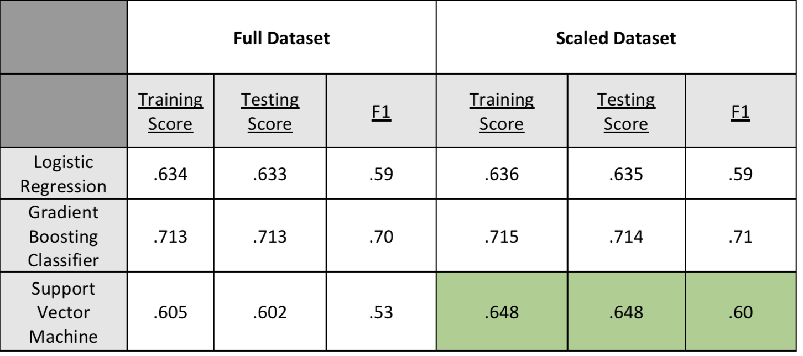
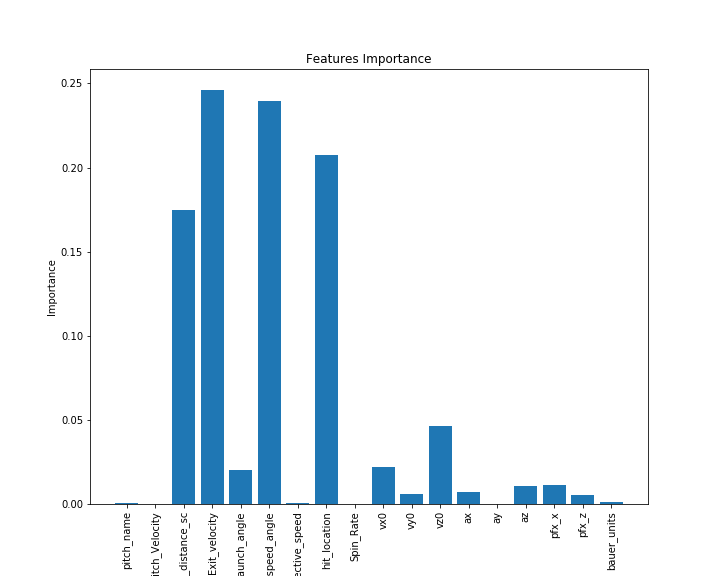

## Pitch_Effective

This project analyzes pitches from Major League Baseball Left Handed Pitchers between the 2015 and 2018 seasons in hopes of evaluating the various pitch metrics and predicting an on field outcome. 

The model evaluations can be found in  Predict_outcome.ipynb. The various data cleaning methods are located within the data_cleaning folder. The scope of this project changed quite a bit, hence the number of cleaning files deriving different forms of the data.

# Data
The data for this project was acquired using the PyBaseball API which pulled statcast data from the 2015-2018 MLB seasons.
The definitions for the column names can be found at this link https://baseballsavant.mlb.com/csv-docs.

Data: https://github.com/jldbc/pybaseball

# Process
After acquiring and cleaning the data, pitching metrics (pitch velocity, movementment measurements, spin rate, exit velocity etc) were feed into the model as depenedent variables and outcomes (strike, ball, foul, Hit-by_pitch, single, double, triple, homerun) were returned as outputs.

The three primary models used were Logistic Regression, Gradient Boosting Classifier, and Support Vector Machine. At first, I tested each model with a subset of the full dataset in order to gauge whether the models would produce sufficient results. This is also in part because when I was initially testing different aspects of the data, some models performed signicantly worse with the full dataset compared to the subset.

The above images displays the R-sqaured scores recorded from the models and their corresponding f1-scores. The logistic regression provided a good base to measure the other models off of. I was encouraged to see that all of the models performed better or remained consistent with their measurements when tested with the full dataset compared to the subset.

In further evaluating the models, the gradient boosting classifier performed the best in terms of accuractely predicting the outcome and interpretting the data. However, I was most intrigued by the results of the SVM. It scored signicantly better with the full dataset. Disclaimer: SVMs do not function with more than 200,000 rows so the SVM used 150,000 rows for full testing.
I was most impressed by its increased f1 score indicating that it was more accurately predicting outcomes.

Next, the data was scaled using a min-max scaler and then feed to the models again.

Again, all of the models either performed better or remain consistent with their readings. The SVM continued to improve, reflected in its improved R-sqaured score and f1-score. At the end of testing the models, the gradient boosting classifier appears to be the best fit for accurately predicting outcomes on a baseball field based on pitch metrics. This is in part because GBCs perform well when dealing with correlated data, as baseball data is often highly correlated. 

# Model Analysis

Above is a graph displaying the feature importance from the Gradient Boosting Classifier. The model relied heavily on four metrics: hit distance, exit velocity, launch speed angle, and hit location. These metrics are all key in determing how well a batted ball is struck and where the ball is expected to land. Important factors in determining the outcome of a play.

I was surprised to see that pitch velocity was almost a non-factor in determining an outcome. This could be in part of the outcomes I was testing for. I would expect that if swinging strike was a possible outcome, velocity would have played a more significant role in the analysis. 

In looking at the predicted results vs. actual results bar graphs generated by the SVM model, the model was fairly good at predicting singles, home runs, and outs. It showed improvment in its understanding of the strike when given the scaled data. Unfortunately, it did not predict a single triple in any of the tests. 

Baseball can be  hard game to interpret and predict for humans and computers. For example, a batted ball with identical metrics could go for a double for one player, but an out for another based on defensive player positioning. These model would have no way of knowing this. Therefore, it is reasonable to assume that no model would return outcomes with 100% accuracy and these models performed strongly with their given data. 

# Future Work

In continuing to work on this project, the next step is to set up a neural network in hopes of continuing the promise that the SVM showed in testing. Also, seeing that the model did not emphasis the pitch metrics as heavily as I expected, I could easily add data from right-handed pitchers in hopes of giving the models more outcomes to understand and process.

